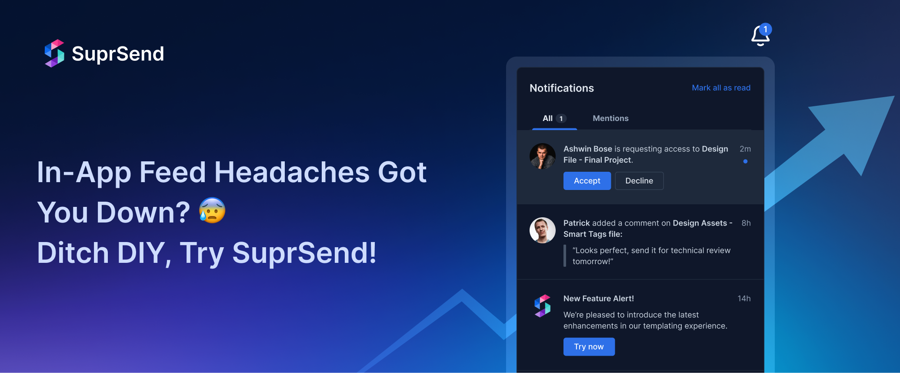

<div align="left">

[](https://suprsend.com)

# [Suprsend](https://suprsend.com)

SuprSend is a central communication stack for easily creating, managing and delivering notifications to your end users on multiple channels. Our single notification API has all the features set, which enables you to send notifications in a reliable and scalable manner and take care of end user experience, thereby eliminating the need to develop any notification service in-house for transactional/engagement notifications.

</div>

## Requirements

Building the API client library requires:

1. Java 1.8+
2. Maven (3.8.3+)/Gradle (7.2+)

If you are adding this library to an Android Application or Library:

3. Android 8.0+ (API Level 26+)

## Installation<a id="installation"></a>
<div align="center">
  <a href="https://konfigthis.com/sdk-sign-up?company=SuprSend&language=Java">
    
  </a>
</div>

### Maven users

Add this dependency to your project's POM:

```xml
<dependency>
  <groupId>com.konfigthis</groupId>
  <artifactId>supr-send-java-sdk</artifactId>
  <version>1.2.1</version>
  <scope>compile</scope>
</dependency>
```

### Gradle users

Add this dependency to your `build.gradle`:

```groovy
// build.gradle
repositories {
  mavenCentral()
}

dependencies {
   implementation "com.konfigthis:supr-send-java-sdk:1.2.1"
}
```

### Android users

Make sure your `build.gradle` file as a `minSdk` version of at least 26:
```groovy
// build.gradle
android {
    defaultConfig {
        minSdk 26
    }
}
```

Also make sure your library or application has internet permissions in your `AndroidManifest.xml`:

```xml
<!--AndroidManifest.xml-->
<?xml version="1.0" encoding="utf-8"?>
<manifest xmlns:android="http://schemas.android.com/apk/res/android"
    xmlns:tools="http://schemas.android.com/tools">
    <uses-permission android:name="android.permission.INTERNET"/>
</manifest>
```

### Others

At first generate the JAR by executing:

```shell
mvn clean package
```

Then manually install the following JARs:

* `target/supr-send-java-sdk-1.2.1.jar`
* `target/lib/*.jar`

## Getting Started

Please follow the [installation](#installation) instruction and execute the following Java code:

```java
import com.konfigthis.client.ApiClient;
import com.konfigthis.client.ApiException;
import com.konfigthis.client.ApiResponse;
import com.konfigthis.client.SuprSend;
import com.konfigthis.client.Configuration;
import com.konfigthis.client.auth.*;
import com.konfigthis.client.model.*;
import com.konfigthis.client.api.BrandApi;
import java.util.List;
import java.util.Map;
import java.util.UUID;

public class Example {
  public static void main(String[] args) {
    Configuration configuration = new Configuration();
    configuration.host = "https://hub.suprsend.com";
    
    configuration.sec0  = "YOUR API KEY";
    SuprSend client = new SuprSend(configuration);
    String brandId = "brandId_example"; // unique identifier of the brand you want to get the details for
    try {
      Object result = client
              .brand
              .brandDataGet(brandId)
              .execute();
    } catch (ApiException e) {
      System.err.println("Exception when calling BrandApi#brandDataGet");
      System.err.println("Status code: " + e.getStatusCode());
      System.err.println("Reason: " + e.getResponseBody());
      System.err.println("Response headers: " + e.getResponseHeaders());
      e.printStackTrace();
    }

    // Use .executeWithHttpInfo() to retrieve HTTP Status Code, Headers and Request
    try {
      ApiResponse<Object> response = client
              .brand
              .brandDataGet(brandId)
              .executeWithHttpInfo();
      System.out.println(response.getResponseBody());
      System.out.println(response.getResponseHeaders());
      System.out.println(response.getStatusCode());
      System.out.println(response.getRoundTripTime());
      System.out.println(response.getRequest());
    } catch (ApiException e) {
      System.err.println("Exception when calling BrandApi#brandDataGet");
      System.err.println("Status code: " + e.getStatusCode());
      System.err.println("Reason: " + e.getResponseBody());
      System.err.println("Response headers: " + e.getResponseHeaders());
      e.printStackTrace();
    }
  }
}

```

## Documentation for API Endpoints

All URIs are relative to *https://hub.suprsend.com*

Class | Method | HTTP request | Description
------------ | ------------- | ------------- | -------------
*BrandApi* | [**brandDataGet**](docs/BrandApi.md#brandDataGet) | **GET** /v1/brand/{brand_id} | Get Brand data
*BrandApi* | [**createOrUpdate**](docs/BrandApi.md#createOrUpdate) | **POST** /v1/brand/{brand_id} | Create / Update Brands
*BrandApi* | [**getCategories**](docs/BrandApi.md#getCategories) | **GET** /v1/brand/{brand_id}/category | Get Brand Default Preference
*BrandApi* | [**listGet**](docs/BrandApi.md#listGet) | **GET** /v1/brand | Get Brand list
*BrandApi* | [**updateDefaultPreference**](docs/BrandApi.md#updateDefaultPreference) | **POST** /v1/brand/{brand_id}/category/{category_slug} | Update Brand Default Preference
*BroadcastApi* | [**triggerMessageList**](docs/BroadcastApi.md#triggerMessageList) | **POST** /{workspace_key}/broadcast | Trigger Broadcast
*EventApi* | [**triggerEvent**](docs/EventApi.md#triggerEvent) | **POST** /event | Trigger an Event
*PrefCategoryApi* | [**getUserPreferencesAllCategories**](docs/PrefCategoryApi.md#getUserPreferencesAllCategories) | **GET** /v1/subscriber/{distinct_id}/category | Get User Preferences (All Categories)
*PreferenceApi* | [**getUserChannelPreferences**](docs/PreferenceApi.md#getUserChannelPreferences) | **GET** /v1/subscriber/{distinct_id}/channel_preference | Get User Preferences (Channel level)
*PreferenceApi* | [**updateChannelPreferences**](docs/PreferenceApi.md#updateChannelPreferences) | **POST** /v1/subscriber/{distinct_id}/channel_preference | Update User Preferences (Channel level)
*SubscriberApi* | [**addToDraftList**](docs/SubscriberApi.md#addToDraftList) | **POST** /v1/subscriber_list/{list_id}/version/{version_id}/subscriber/add | Add Subscribers to Draft List
*SubscriberApi* | [**addToList**](docs/SubscriberApi.md#addToList) | **POST** /v1/subscriber_list/{list_id}/subscriber/add | Add Subscribers to List
*SubscriberApi* | [**deleteDraftList**](docs/SubscriberApi.md#deleteDraftList) | **PATCH** /v1/subscriber_list/{list_id}/version/{version_id}/delete | Delete Draft List
*SubscriberApi* | [**finishSyncDraftVersion**](docs/SubscriberApi.md#finishSyncDraftVersion) | **PATCH** /v1/subscriber_list/{list_id}/version/{version_id}/finish_sync | Finish Sync
*SubscriberApi* | [**removeFromDraftList**](docs/SubscriberApi.md#removeFromDraftList) | **POST** /v1/subscriber_list/{list_id}/version/{version_id}/subscriber/remove | Remove Subscribers from Draft List
*SubscriberApi* | [**updateUserPreferencesCategory**](docs/SubscriberApi.md#updateUserPreferencesCategory) | **POST** /v1/subscriber/{distinct_id}/category/{category_slug} | Update User Preferences (Category level)
*SubscriberListApi* | [**createList**](docs/SubscriberListApi.md#createList) | **POST** /v1/subscriber_list | Create a List
*SubscriberListApi* | [**deleteList**](docs/SubscriberListApi.md#deleteList) | **PATCH** /v1/subscriber_list/{list_id}/delete | Delete List
*SubscriberListApi* | [**getAllLists**](docs/SubscriberListApi.md#getAllLists) | **GET** /v1/subscriber_list | Get all Lists
*SubscriberListApi* | [**getListData**](docs/SubscriberListApi.md#getListData) | **GET** /v1/subscriber_list/{list_id} | Get List data
*SubscriberListApi* | [**removeSubscribersFromList**](docs/SubscriberListApi.md#removeSubscribersFromList) | **POST** /v1/subscriber_list/{list_id}/subscriber/remove | Remove Subscribers from List
*SyncApi* | [**listStartSync**](docs/SyncApi.md#listStartSync) | **POST** /v1/subscriber_list/{list_id}/start_sync | Start Sync
*TemplateApi* | [**getContentChannel**](docs/TemplateApi.md#getContentChannel) | **GET** /v1/template/{template_slug}/channel/{channel_slug} | Fetch Template content for a channel
*TemplateApi* | [**getDetails**](docs/TemplateApi.md#getDetails) | **GET** /v1/template/{template_slug} | Fetch Template details
*TemplateApi* | [**getList**](docs/TemplateApi.md#getList) | **GET** /v1/template | Fetch Template List
*WorkflowApi* | [**configureTrigger**](docs/WorkflowApi.md#configureTrigger) | **POST** /{workspace_key}/trigger | Trigger Workflow


## Documentation for Models

 - [BrandCreateOrUpdateRequest](docs/BrandCreateOrUpdateRequest.md)
 - [BrandCreateOrUpdateRequestSocialLinks](docs/BrandCreateOrUpdateRequestSocialLinks.md)
 - [BrandUpdateDefaultPreferenceRequest](docs/BrandUpdateDefaultPreferenceRequest.md)
 - [BroadcastTriggerMessageListRequest](docs/BroadcastTriggerMessageListRequest.md)
 - [EventTriggerEventRequest](docs/EventTriggerEventRequest.md)
 - [EventTriggerEventRequestUserOperationsInner](docs/EventTriggerEventRequestUserOperationsInner.md)
 - [PreferenceUpdateChannelPreferencesRequest](docs/PreferenceUpdateChannelPreferencesRequest.md)
 - [PreferenceUpdateChannelPreferencesRequestChannelPreferencesInner](docs/PreferenceUpdateChannelPreferencesRequestChannelPreferencesInner.md)
 - [SubscriberAddToDraftListRequest](docs/SubscriberAddToDraftListRequest.md)
 - [SubscriberAddToListRequest](docs/SubscriberAddToListRequest.md)
 - [SubscriberListCreateListRequest](docs/SubscriberListCreateListRequest.md)
 - [SubscriberListRemoveSubscribersFromListRequest](docs/SubscriberListRemoveSubscribersFromListRequest.md)
 - [SubscriberRemoveFromDraftListRequest](docs/SubscriberRemoveFromDraftListRequest.md)
 - [SubscriberUpdateUserPreferencesCategoryRequest](docs/SubscriberUpdateUserPreferencesCategoryRequest.md)
 - [TemplateGetContentChannelResponse](docs/TemplateGetContentChannelResponse.md)
 - [TemplateGetContentChannelResponseChannel](docs/TemplateGetContentChannelResponseChannel.md)
 - [TemplateGetContentChannelResponseVersionsInner](docs/TemplateGetContentChannelResponseVersionsInner.md)
 - [TemplateGetContentChannelResponseVersionsInnerTemplatesInner](docs/TemplateGetContentChannelResponseVersionsInnerTemplatesInner.md)
 - [TemplateGetContentChannelResponseVersionsInnerTemplatesInnerContent](docs/TemplateGetContentChannelResponseVersionsInnerTemplatesInnerContent.md)
 - [TemplateGetContentChannelResponseVersionsInnerTemplatesInnerLanguage](docs/TemplateGetContentChannelResponseVersionsInnerTemplatesInnerLanguage.md)
 - [TemplateGetContentChannelResponseVersionsInnerTemplatesInnerUpdatedBy](docs/TemplateGetContentChannelResponseVersionsInnerTemplatesInnerUpdatedBy.md)
 - [TemplateGetContentChannelResponseVersionsInnerUpdatedBy](docs/TemplateGetContentChannelResponseVersionsInnerUpdatedBy.md)
 - [TemplateGetDetailsResponse](docs/TemplateGetDetailsResponse.md)
 - [TemplateGetDetailsResponseChannelsInner](docs/TemplateGetDetailsResponseChannelsInner.md)
 - [TemplateGetDetailsResponseChannelsInnerChannel](docs/TemplateGetDetailsResponseChannelsInnerChannel.md)
 - [TemplateGetDetailsResponseChannelsInnerVersionsInner](docs/TemplateGetDetailsResponseChannelsInnerVersionsInner.md)
 - [TemplateGetDetailsResponseChannelsInnerVersionsInnerTemplatesInner](docs/TemplateGetDetailsResponseChannelsInnerVersionsInnerTemplatesInner.md)
 - [TemplateGetDetailsResponseChannelsInnerVersionsInnerTemplatesInnerApprovalCycle](docs/TemplateGetDetailsResponseChannelsInnerVersionsInnerTemplatesInnerApprovalCycle.md)
 - [TemplateGetDetailsResponseChannelsInnerVersionsInnerTemplatesInnerContent](docs/TemplateGetDetailsResponseChannelsInnerVersionsInnerTemplatesInnerContent.md)
 - [TemplateGetDetailsResponseChannelsInnerVersionsInnerTemplatesInnerLanguage](docs/TemplateGetDetailsResponseChannelsInnerVersionsInnerTemplatesInnerLanguage.md)
 - [TemplateGetDetailsResponseChannelsInnerVersionsInnerTemplatesInnerUpdatedBy](docs/TemplateGetDetailsResponseChannelsInnerVersionsInnerTemplatesInnerUpdatedBy.md)
 - [TemplateGetDetailsResponseChannelsInnerVersionsInnerUpdatedBy](docs/TemplateGetDetailsResponseChannelsInnerVersionsInnerUpdatedBy.md)
 - [TemplateGetDetailsResponseDefaultLanguage](docs/TemplateGetDetailsResponseDefaultLanguage.md)
 - [TemplateGetDetailsResponseUpdatedBy](docs/TemplateGetDetailsResponseUpdatedBy.md)
 - [TemplateGetListResponse](docs/TemplateGetListResponse.md)
 - [TemplateGetListResponseMeta](docs/TemplateGetListResponseMeta.md)
 - [TemplateGetListResponseResultsInner](docs/TemplateGetListResponseResultsInner.md)
 - [TemplateGetListResponseResultsInnerChannelsInner](docs/TemplateGetListResponseResultsInnerChannelsInner.md)
 - [TemplateGetListResponseResultsInnerChannelsInnerChannel](docs/TemplateGetListResponseResultsInnerChannelsInnerChannel.md)
 - [TemplateGetListResponseResultsInnerDefaultLanguage](docs/TemplateGetListResponseResultsInnerDefaultLanguage.md)
 - [TemplateGetListResponseResultsInnerUpdatedBy](docs/TemplateGetListResponseResultsInnerUpdatedBy.md)
 - [WorkflowConfigureTriggerRequest](docs/WorkflowConfigureTriggerRequest.md)
 - [WorkflowConfigureTriggerRequestDelivery](docs/WorkflowConfigureTriggerRequestDelivery.md)
 - [WorkflowConfigureTriggerRequestUsersInner](docs/WorkflowConfigureTriggerRequestUsersInner.md)
 - [WorkflowConfigureTriggerRequestUsersInnerAndroidpushInner](docs/WorkflowConfigureTriggerRequestUsersInnerAndroidpushInner.md)
 - [WorkflowConfigureTriggerRequestUsersInnerIospushInner](docs/WorkflowConfigureTriggerRequestUsersInnerIospushInner.md)


## Author
This Java package is automatically generated by [Konfig](https://konfigthis.com)
